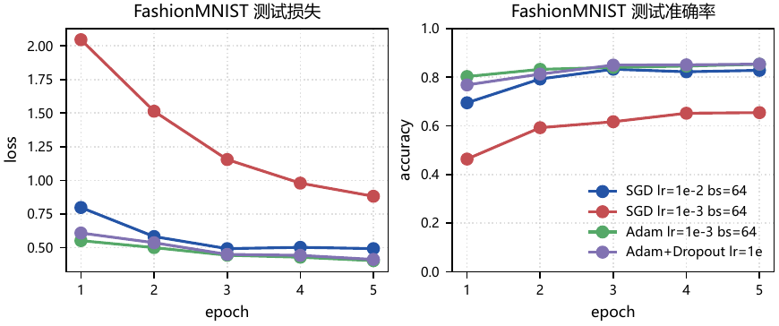
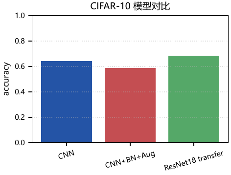
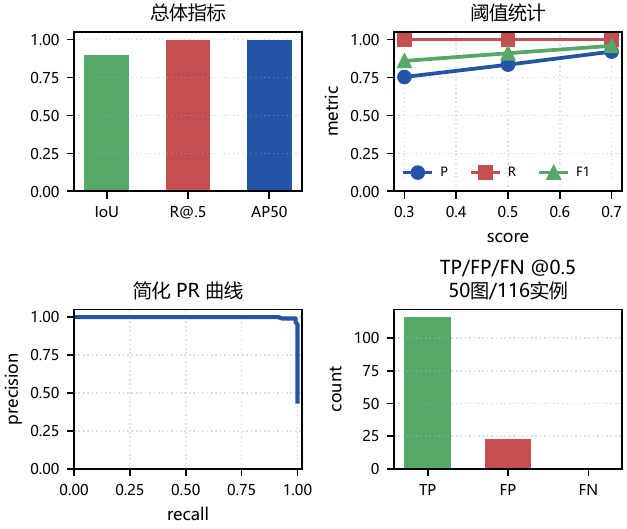
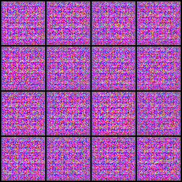
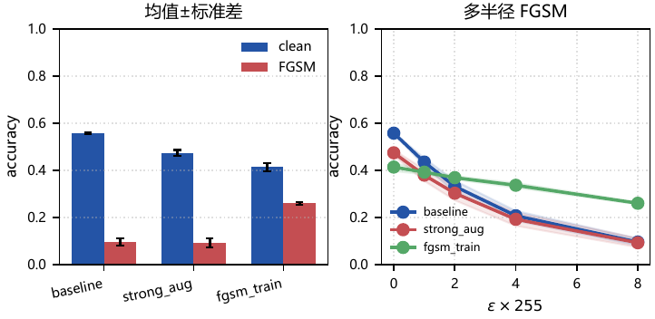

# Pattern Recognition and Brain-Like Intelligence Experiments

This repository contains a reproducible course experiment suite for pattern recognition and brain-like intelligence. It covers scientific Python, NumPy vectorization, PyTorch training, CIFAR-10 image classification, transfer learning, Faster R-CNN pedestrian detection, DCGAN generation, FGSM attacks, and robustness/calibration analysis.

[Public PDF report](submission/report/模式识别与类脑智能期末实验报告_公开版.pdf)

## What Is Included

- `submission/src/experiments.py`: experiment runners, training loops, evaluation, detection metrics, robustness tests.
- `submission/src/figures.py`: all report figures and visual summaries.
- `submission/src/build_report.py`: LaTeX report generation, private/public cover handling, PDF validation.
- `submission/results/`: compact JSON metrics used by the report builder.
- `submission/figures/`: generated plots and visual evidence.
- `run_all.ps1`: single entry point for setup, data, experiments, figures, report, and checks.

Large datasets, pretrained checkpoints, virtual environments, and private cover metadata are intentionally excluded from git. They are regenerated or downloaded locally by the pipeline.

## Experiment Map

| Area | Dataset | Main question | Evidence |
|---|---:|---|---|
| NumPy foundations | synthetic arrays/images | How do vectorization, broadcasting, and memory layout affect runtime? | speedup curves, distance matrices, image operations |
| PyTorch basics | FashionMNIST | How do optimizer and regularization choices change convergence? | training curves, confusion matrix, gradient norms |
| Image classification | CIFAR-10 | How do CNNs, augmentation, BN, and transfer learning compare under a fixed budget? | model table, per-class accuracy, error grid |
| Detection / generation / attacks | PennFudan, Hymenoptera, MNIST, CelebA subset | How do structured prediction, transfer learning, adversarial examples, and generation differ from classification? | Faster R-CNN metrics, FGSM curve, DCGAN samples |
| Robust recognition | CIFAR-10 | What trade-offs exist among clean accuracy, FGSM robustness, calibration, and latency? | multi-seed robust metrics, reliability plot |

## Selected Results

FashionMNIST optimizer comparison shows Adam and Adam+Dropout reaching essentially tied accuracy, while Adam has slightly lower loss and Dropout mainly demonstrates regularization potential.



CIFAR-10 results compare compact CNN baselines, BN/augmentation, and ResNet18 transfer learning. The report avoids over-claiming a single split as universally decisive and keeps the exact data budget visible.



PennFudan detection uses Faster R-CNN ResNet50-FPN with a frozen backbone and reports threshold-sensitive TP/FP/FN, precision, recall, F1, and AP50 evidence rather than only qualitative overlays.



DCGAN is included as a generative counterpart to discriminative recognition. The sample grid is interpreted together with loss curves because adversarial training is not a monotonic supervised loss problem.



The robustness section separates clean accuracy, FGSM robust accuracy, calibration, and latency. `strong_aug` is not treated as a replacement for adversarial training; FGSM training improves the attack metric but has its own calibration trade-off.



## Reproduction

Use PowerShell from the repository root:

```powershell
.\run_all.ps1 -Stage all -Profile full -Device auto -Seed 2026
```

For faster iteration after results already exist:

```powershell
.\run_all.ps1 -Stage figures -Profile full -Device auto -Seed 2026
.\run_all.ps1 -Stage report  -Profile full -Device auto -Seed 2026
.\run_all.ps1 -Stage check   -Profile full -Device auto -Seed 2026
```

The report builder produces two PDFs:

- `submission/report/模式识别与类脑智能期末实验报告.pdf`: local private report, if `submission/private_cover.json` exists.
- `submission/report/模式识别与类脑智能期末实验报告_公开版.pdf`: public report without class or student ID fields.

To customize private cover metadata locally, copy `submission/private_cover.example.json` to `submission/private_cover.json`. The private file is ignored by git.

## Validation

The `check` stage uses `pdfinfo` and `pdftoppm` to verify that generated PDFs render, stay within the page budget, and do not contain blank pages. The LaTeX logs are also scanned for hard errors, undefined control sequences, undefined references, and overfull boxes.

## Notes on Scope

This repository is designed as a course-scale reproducible experiment package, not as a leaderboard submission. Training budgets are intentionally modest and reported in the PDF. The emphasis is on controlled comparisons, reproducible evidence, and careful interpretation of accuracy, localization, robustness, calibration, and deployment cost.
